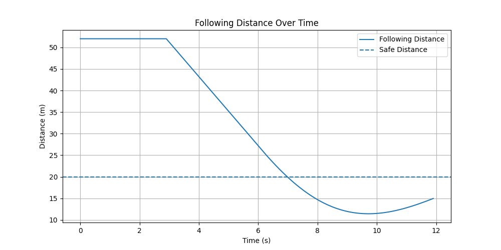
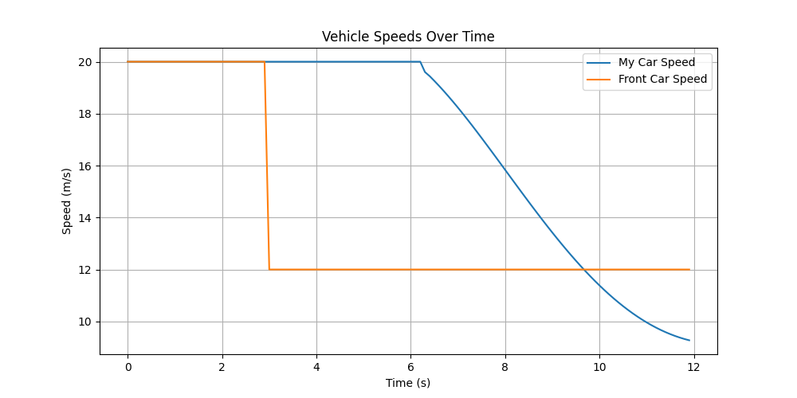
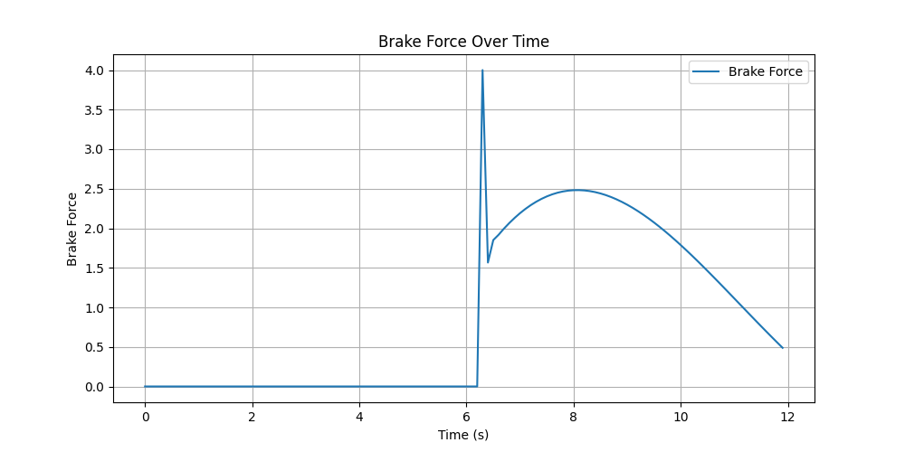
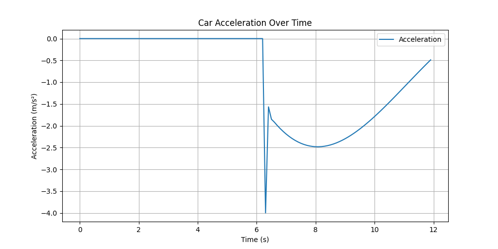

# Adaptive Cruise Control with PID and Predictive Braking

## Overview

This project implements a simulation of an adaptive cruise control system. It models how a vehicle maintains a safe following distance while responding to changes in a lead vehicle’s speed.

The system uses a PID controller to regulate braking and incorporates relative velocity to improve response time and stability.

This project focuses on improving braking behavior through control system design and iterative tuning.

---

## Key Concepts

* Closed-loop control using a PID controller
* Modeling of position, velocity, and acceleration
* Use of relative velocity for earlier braking decisions
* System response to sudden changes in the environment

---

## System Model

The simulation updates motion using basic relationships:

* Position is updated from velocity
* Velocity is updated from acceleration
* Acceleration is determined by braking force

This reflects how real vehicle motion is modeled.

---

## Control Strategy

Braking force is computed using a PID controller based on the error between the current distance and a desired safe distance.

To improve performance, the controller includes relative velocity:

```python
error = (safe_distance - distance) + k * relative_velocity
```

This allows the system to react earlier when approaching the lead vehicle too quickly.

---

## Simulation Scenario

* Both vehicles start at 20 m/s
* At 3 seconds, the lead vehicle slows to 12 m/s
* The following vehicle must adjust to maintain a safe distance

---

## Results

### Following Distance


### Vehicle Speeds


### Brake Force


### Acceleration


The system was improved through iterative tuning and control design changes:

Final system achieved a minimum following distance of **11.43 m** under a sudden lead vehicle slowdown.

- Initial controller: minimum distance of 3.89 m  
- After PID tuning: 6.54 m  
- With predictive braking (relative velocity): 11.43 m  

These improvements reduced late braking, increased safety margins, and produced a more stable system response under dynamic conditions.

This demonstrates the importance of incorporating predictive information, such as relative velocity, rather than relying solely on reactive distance-based control.

---

## Project Structure

```
main.py
simulation.py
pid_controller.py
```

---

## How to Run

Install dependencies:

```
pip install matplotlib
```

Run the simulation:

```
python main.py
```

---

## Summary

This project demonstrates how control systems and basic physics can be used to model real-time decision making in vehicle systems. It highlights the importance of anticipating system behavior, not just reacting to it.
